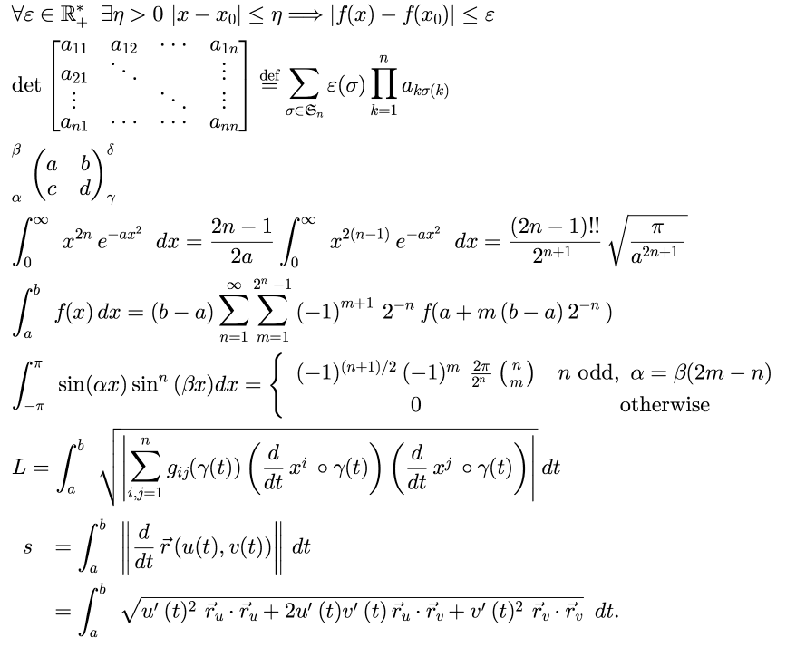

# jlatexmathfx general Information
jlatexmathfx is a port of [jlatexmath](http://forge.scilab.org/index.php/p/jlatexmath/) to javafx

The control is usable but *not thoroughly* tested.

The performance has not been optimized but is acceptable on local tests. Upon first use initialization will happen but 
subsequent calls will be faster.

# Version
0.3.2

# Building the project
The project uses [gradle](http://www.gradle.org) as build tool.
To generate the jar use:

```
gradle jar
```

#Usage
LatexMathControl is a styleable javafx control. 

The following properties control the visulaization

|Property | Default | CSS Property  Purpose
|---------|------|--------
|formula  |""    | fx-formula | The laTeX encoded formula
|size     |Default javafx font size| fx-size | Font scaling, default is equal to the javafx default size
|bgColor  |Color.Transparant| fx-bg | Background Color
|textColor|Color.BLACK| fx-text-color | fill color of the Font


##Example

This example has been adapted from the origial swing based distribution.
The code produces the following output




```

public class FXApp extends Application {
    @Override
    public void start(Stage primaryStage) throws Exception {
        String latex = "\\begin{array}{l}";
        latex += "\\forall\\varepsilon\\in\\mathbb{R}_+^*\\ \\exists\\eta>0\\ |x-x_0|\\leq\\eta\\Longrightarrow|f(x)-f(x_0)|\\leq\\varepsilon\\\\";
        latex += "\\det\\begin{bmatrix}a_{11}&a_{12}&\\cdots&a_{1n}\\\\a_{21}&\\ddots&&\\vdots\\\\\\vdots&&\\ddots&\\vdots\\\\a_{n1}&\\cdots&\\cdots&a_{nn}\\end{bmatrix}\\overset{\\mathrm{def}}{=}\\sum_{\\sigma\\in\\mathfrak{S}_n}\\varepsilon(\\sigma)\\prod_{k=1}^n a_{k\\sigma(k)}\\\\";
        latex += "\\sideset{_\\alpha^\\beta}{_\\gamma^\\delta}{\\begin{pmatrix}a&b\\\\c&d\\end{pmatrix}}\\\\";
        latex += "\\int_0^\\infty{x^{2n} e^{-a x^2}\\,dx} = \\frac{2n-1}{2a} \\int_0^\\infty{x^{2(n-1)} e^{-a x^2}\\,dx} = \\frac{(2n-1)!!}{2^{n+1}} \\sqrt{\\frac{\\pi}{a^{2n+1}}}\\\\";
        latex += "\\int_a^b{f(x)\\,dx} = (b - a) \\sum\\limits_{n = 1}^\\infty  {\\sum\\limits_{m = 1}^{2^n  - 1} {\\left( { - 1} \\right)^{m + 1} } } 2^{ - n} f(a + m\\left( {b - a} \\right)2^{-n} )\\\\";
        latex += "\\int_{-\\pi}^{\\pi} \\sin(\\alpha x) \\sin^n(\\beta x) dx = \\textstyle{\\left \\{ \\begin{array}{cc} (-1)^{(n+1)/2} (-1)^m \\frac{2 \\pi}{2^n} \\binom{n}{m} & n \\mbox{ odd},\\ \\alpha = \\beta (2m-n) \\\\ 0 & \\mbox{otherwise} \\\\ \\end{array} \\right .}\\\\";
        latex += "L = \\int_a^b \\sqrt{ \\left|\\sum_{i,j=1}^ng_{ij}(\\gamma(t))\\left(\\frac{d}{dt}x^i\\circ\\gamma(t)\\right)\\left(\\frac{d}{dt}x^j\\circ\\gamma(t)\\right)\\right|}\\,dt\\\\";
        latex += "\\begin{array}{rl} s &= \\int_a^b\\left\\|\\frac{d}{dt}\\vec{r}\\,(u(t),v(t))\\right\\|\\,dt \\\\ &= \\int_a^b \\sqrt{u'(t)^2\\,\\vec{r}_u\\cdot\\vec{r}_u + 2u'(t)v'(t)\\, \\vec{r}_u\\cdot\\vec{r}_v+ v'(t)^2\\,\\vec{r}_v\\cdot\\vec{r}_v}\\,\\,\\, dt. \\end{array}\\\\";
        latex += "\\end{array}";

        LateXMathControl lc=new LateXMathControl(latex);
        StackPane pane=new StackPane();
        pane.getChildren().add(lc);

        Scene scene=new Scene(pane);
        primaryStage.setScene(scene);
        primaryStage.setWidth(800);
        primaryStage.setHeight(600);

        primaryStage.show();
    }

    public static void main(String[] args) {
        launch(args);
    }

}

```


#Avalability via Gradle or maven


## Maven dependency

```
<dependency>
  <groupId>com.proudapes</groupId>
  <artifactId>jlatexmathfx</artifactId>
  <version>0.3.2</version>
</dependency>
```


## Gradle dependency

```
compile group: 'com.proudapes', name: 'jlatexmathfx', version: '0.3.2'
```

#License
GPL V2
